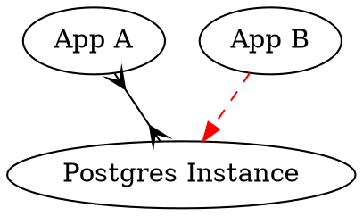

**Graphviz** is like markdown, for diagrams.

It's a tool that can transform text input into a "directed graph" output, which is nodes pointing to other nodes. You can use it for architecture diagrams, DB diagrams, documentation for users, etc.

# Graphviz Tutorial

This is a step by step tutorial, introducing commonly used features of graphviz one at a time.

## Goals

By the end, we'll produce this diagram.

You'll learn about:
- nodes & connections
- how to style connections (nodes are similar)
- how to do multiline text in nodes
- grouping nodes using subgraphs
- applying styles globally
- ordering affects how it's drawn
- specify where on the node the connection attachmes

## How to navigate this repo

To start, open the [commits](https://github.com/caseywatts/graphviz-tutorial/commits/master) tab and open each commit from bottom to top - each one in its own tab.

Here is an example of what the commit view looks like
- the **description** in the commit at the top describes the change
- you can see both the **text changes** and the **image changes**

## Using graphviz on your own

You'll want to use a tool with a two-pane layout - the left side is the source text, the right side is the image output.
- For just you working on it, use <http://graphviz.it> (shown above; it has more features)
- For realtime collaboration, use <http://graphvizrepl.com>

## Keeping track of diagrams
You should keep track of your diagrams somewhere - I recommend in a github repo. Suggestion-instructions here in this [gist](https://caseywatts.com/graphviz).

## Tutorial

As we go through this, follow along in <graphviz.it> or a text editor plugin ([atom example](https://github.com/sverweij/atom-graphviz-preview-plus)). I also use a github-friendly paste-image [atom plugin](https://github.com/tlnagy/atom-markdown-image-assistant).

The reference page I end up on most is the general [`attrs` one](https://www.graphviz.org/doc/info/attrs.html).

### Basic Structure
Graphs are wrapped in `digraph G {}` - G is an arbitrary name. The way we use graphviz, we can't/won't do graphs with separate names.

A graphviz **graph** has **nodes** connected by **edges** (I'll use the more colloquial term *connections*). Here is a simple example, with (optional) text labels on these the connections.

### Colors & Quotes
For colors, you can use the [x11 palette](https://www.graphviz.org/doc/info/colors.html), or hex colors like `"#FF0000"`. Make sure to always use **double quotes** in graphviz. You will get errors with single quotes sometimes - like with hex colors. Sometimes you can get away with not using quotes at all, and that's really okay to do in graphviz. You'll know quickly whether it compiles or not.

### More Edge Properties

You can change many other properties of edges (connections), too!

### Multi-line Text

If you want to have more than one line of text in a node, you can manually put a newline line break using `\n`.

### Subgraph Boxes

You can draw a box around a group of nodes, and label it. This is a `subgraph`. The biggest gotcha here is that subgraph names must start with `cluster`. You label this using `label="My Subgraph Box Title"`. You can make the labels go to the bottom using `labelloc=b`, or move it explicitly to the top using `labelloc=t`.

 I recommend declaring nodes within the subgraph (one node per line) - not making connections within in a subgraph. Define the connections after and outside the subgraph definitions.

### Global Styles

If you want to style your graphs in generally the same way, you can declare some baseline attributes at the top. Any attribute you set on a node or edge below will override, like CSS.

Here's an example with Heroku's base styles. Also fleshing the example out more with another node.

